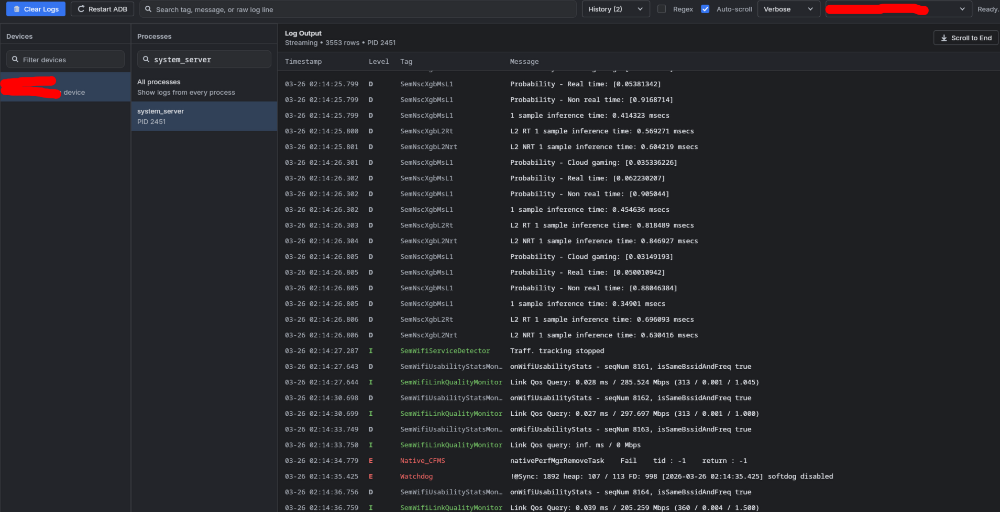

# Desktop Logcat Viewer

Standalone desktop Logcat viewer built with Kotlin, Compose Multiplatform for Desktop, Jewel styling, and `adblib`.

It is meant to feel close to the modern Android Studio logcat experience while staying lightweight and runnable as a normal desktop app.

## Screenshot


## What It Does

- Lists connected Android devices through `adb`
- Lists running processes for the selected device
- Streams `logcat` in real time without blocking the UI
- Filters logs by:
  - device
  - process
  - log level
  - free text
  - advanced search clauses such as `tag:ExampleTag` and `message:test`
- Tracks a selected process across restarts by process name
- Shows process lifecycle markers such as:
  - `----- Process stopped: pid: 213 ------`
  - `----- Process started: pid: 1231 ------`
- Keeps a history of previously used log filters
- Supports auto-scroll, manual scroll-to-end, clearing logs, and restarting ADB

## UI Overview

- `Devices` sidebar:
  Pick the active device and filter the device list.

- `Processes` sidebar:
  Pick a process or `All processes`. If a selected process restarts with a new PID, the app follows it automatically.

- Top toolbar:
  Main log search, filter history, regex toggle, auto-scroll toggle, log level selector, device selector, clear logs, and restart ADB.

- Main log table:
  Shows timestamp, level, tag, and message in a monospaced layout.

- Detail panel:
  Click a row to inspect the full raw log line.

## Requirements

- A full JDK 17+ or 21+ for building
- `adb` available on `PATH`, or present under:
  - `ANDROID_SDK_ROOT/platform-tools/adb`
  - `ANDROID_HOME/platform-tools/adb`
- At least one Android device or emulator if you want to stream logs

## Run

macOS/Linux:

```bash
./gradlew :composeApp:run
```

Windows:

```powershell
.\gradlew.bat :composeApp:run
```

## Build

Compile:

```bash
./gradlew :composeApp:compileKotlinJvm
```

Package native distributions:

```bash
./gradlew :composeApp:packageDistributionForCurrentOS
```

If Gradle fails because the system Java does not include `javac`, point `JAVA_HOME` to a full JDK before running Gradle.

## How To Use

1. Start the app.
2. Select a device from the `Devices` sidebar or toolbar dropdown.
3. Optionally select a process from the `Processes` sidebar.
4. Use the top search field to narrow logs.
5. Click a row to inspect the full message in the bottom panel.

## Search Syntax

The main log search supports plain text, regex, and field-specific clauses.

### Plain text

- `crash`
- `network timeout`

Matches against tag, message, and raw log line.

### Field filters

- `tag:ExampleTag`
- `message:timeout`

### Negation

- `-tag:ExampleTag`
- `-message:heartbeat`

### Mixed examples

- `tag:ActivityManager message:crash`
- `tag:MyApp -message:heartbeat`
- `message:"fatal exception"`

### Regex mode

Enable the `Regex` toggle to interpret each token value as a regular expression.

Examples:

- `tag:^MyApp`
- `message:TimeoutException|SocketTimeoutException`
- `-message:.*heartbeat.*`

If a regex is invalid, the toolbar shows the parse error and filtering is not applied until the query is corrected.

## Filter History

- Press `Enter` in the main search field to save the current filter
- Use the `History` dropdown in the toolbar to re-apply a saved filter
- Duplicate entries are de-duplicated and moved to the top

## Auto-Scroll Behavior

- If `Auto-scroll` is enabled, new logs keep the table pinned to the bottom
- If you manually scroll upward, auto-scroll turns off
- If you scroll back to the bottom manually, auto-scroll turns back on
- `Scroll to End` jumps to the latest row and re-enables auto-scroll

## Process Tracking Behavior

When `All processes` is selected, the app streams normally without PID pinning.

When a specific process is selected:

- the app streams logs for the current PID
- it keeps polling the process list by process name
- if the PID disappears, it emits a `Process stopped` marker
- if the same process name reappears under a new PID, it emits a `Process started` marker and resumes streaming with the new PID

Current limitation:

- If multiple running processes share the exact same process name, the app follows the first matching one it finds.

## Toolbar Actions

- `Clear Logs`
  Clears the visible log list and runs `logcat -c` on the selected device.

- `Restart ADB`
  Runs `adb kill-server` then `adb start-server`, then reconnects.

- `Scroll to End`
  Jumps to the latest log row and re-enables auto-scroll.

## Implementation Notes

- UI: Compose Multiplatform Desktop
- Look and feel: Jewel-inspired dark desktop UI
- ADB transport: `com.android.tools.adblib`
- Log rendering: lazy list with row trimming to cap memory usage
- Current in-memory log cap: `50,000` rows

## Project Structure

- [composeApp](/home/lidan/IdeaProjects/logcatui/composeApp)
  Desktop application module

- [composeApp/src/jvmMain/kotlin/me/lidan/logcatui/App.kt](/home/lidan/IdeaProjects/logcatui/composeApp/src/jvmMain/kotlin/me/lidan/logcatui/App.kt)
  Desktop UI and filter parsing

- [composeApp/src/jvmMain/kotlin/me/lidan/logcatui/LogcatBackend.kt](/home/lidan/IdeaProjects/logcatui/composeApp/src/jvmMain/kotlin/me/lidan/logcatui/LogcatBackend.kt)
  ADB integration, streaming, process tracking, and state management

## Development

Useful commands:

```bash
./gradlew :composeApp:compileKotlinJvm
./gradlew :composeApp:jvmTest
./gradlew :composeApp:run
```
